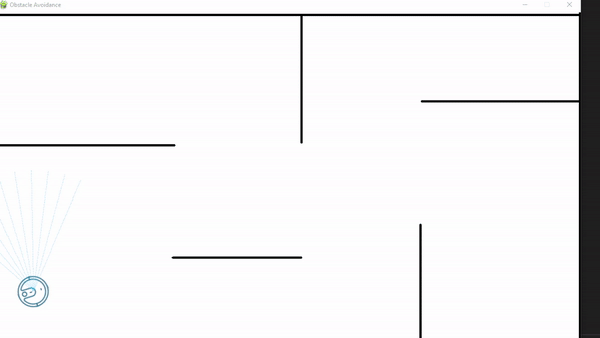
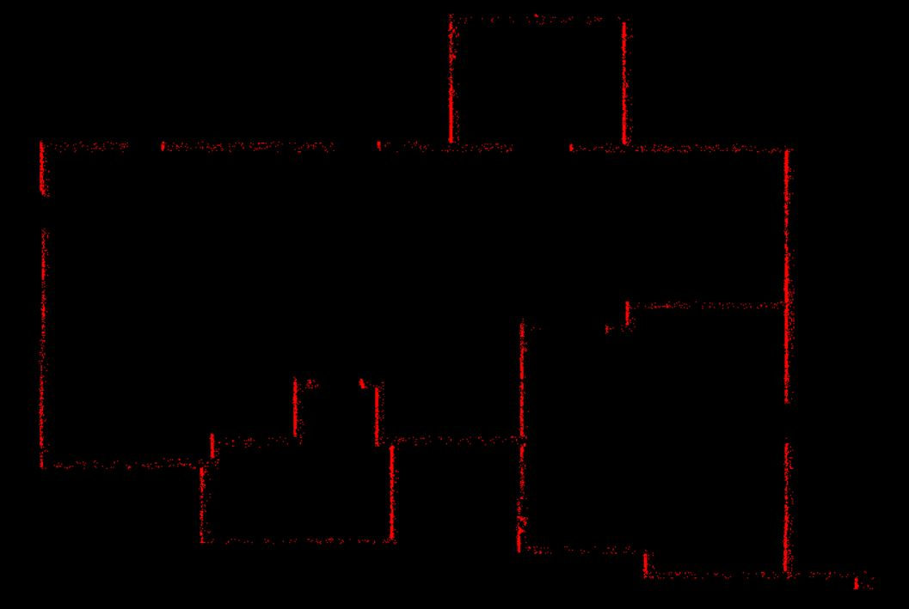

### SLAM and LIDAR Simulation

Ensure that your **python** version is >= 3.7

### Robot obstacle avoidance

```
.
├── obstacle-avoidance-simulation
|   ├── main.py
|   ├── robot.py
|   ├── ultrasonic.py
|   └── graphics.py
```

To run the robot simulation, type the following command in the `obstacle-avoidance-simulation/` directory:

```bash
   $ python main.py
```





### Lidar Simulation

```
.
├── lidar-sensor-simulation
|   ├── env.py
|   ├── sensors.py
|   └── main.py
```

To run the lidar sensor simulation, type the following command in the `lidar-sensor-simulation/` directory:

```bash
   $ python main.py
```

The output will be a screen where you can move the mouse simulating a lidar sensor



Source: https://www.youtube.com/watch?v=pmmUi6DasoM
